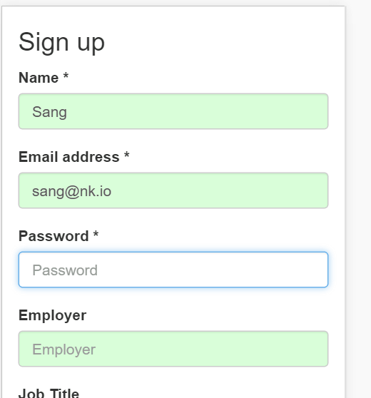

# Udacity-Nano-Project-1--Event-Planner
Meet-Up Event Planner

##[Live Demo] (http://shanthiacharya.github.io/Udacity-Nano-Project-1--Event-Planner)  (hosted on Github)

This is a responsive web application to create a meet-up event based on [Bootstrap](http://getbootstrap.com/).

1. Works for both desktop and mobile.

2. Instant validation on forms and password strength meter

3. Google location Api to autosuggest address
4. App uses firebase as backend to store event information.
5. Grunt file to automate the front end workflow

Installation
---
1. Download and Unzip this repository
2. Install Dependencies


```
    npm install 
    npm install gulp
    npm install gulp-autoprefixer
    npm install browser-sync
    npm install gulp-concat
    npm install gulp-uglify
```    

 Running
 ---
```
   gulp
 ``` 
   Browser opens at [http://localhost:3000](http://localhost:3000) 

